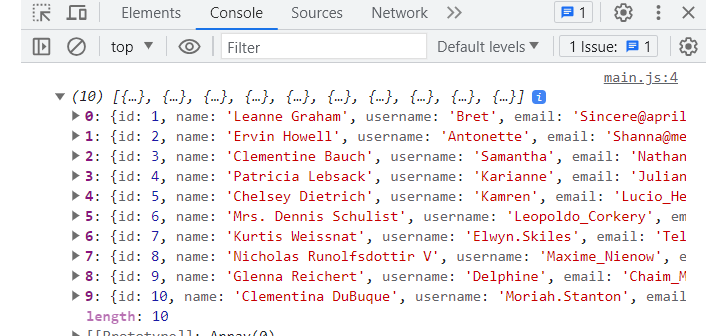

## Fake API for testing

### 1. Tool
- [POSTMAN](https://www.postman.com/)
- [INSOMNIA](https://insomnia.rest/)
- [THUNDER CLIENT](https://www.thunderclient.com/) (VSCODE EXTENSION)

### 2. AXIOS Library
[AXIOS](https://axios-http.com/docs/intro)

- CDN:
```javascript
    <script src="https://cdn.jsdelivr.net/npm/axios/dist/axios.min.js"></script>
    
    OR

    <script src="https://unpkg.com/axios/dist/axios.min.js"></script>
```
- INSTALLING
```javascript
    npm install axios
```

### 3. Fake API URL
- [JSONPLACEHOLDER](https://jsonplaceholder.typicode.com/)

> `Users: https://jsonplaceholder.typicode.com/users`

> `Posts: https://jsonplaceholder.typicode.com/posts`

> `Todos: https://jsonplaceholder.typicode/todos`

> `Comments: https://jsonplaceholder.typicode.com/comments`

> `Photos: https://jsonplaceholder.typicode.com/photos`

- [REQRES](https://reqres.in/)
> `Users: https://reqres.in/api/users?page=2`

> `User: https://reqres.in/api/users/2`

- [RANDOMUSER](https://randomuser.me/api)
> `User: https://randomuser.me/api`

- [Pixaby API](https://pixabay.com/service/about/api/)

> `Photos: https://pixabay.com/api/?key=14001068-da63091f2a2cb98e1d7cc1d82&q=yellow+flowers&image_type=photo&pretty=true`

### 4. Example using API with Axios
`index.html`
```html:
<!DOCTYPE html>
<html lang="en">
<head>
    <meta charset="UTF-8">
    <meta name="viewport" content="width=device-width, initial-scale=1.0">
    <title>Example</title>
    <script src="https://unpkg.com/axios/dist/axios.min.js"></script>
    <script src="main.js" defer></script>
</head>
<body>
    
</body>
</html>
```
`main.js`
```js:
const URL = "https://jsonplaceholder.typicode.com/users";

axios.get(URL).then(function(response) {
    console.log(response.data);
})
```
`Response in console:`
